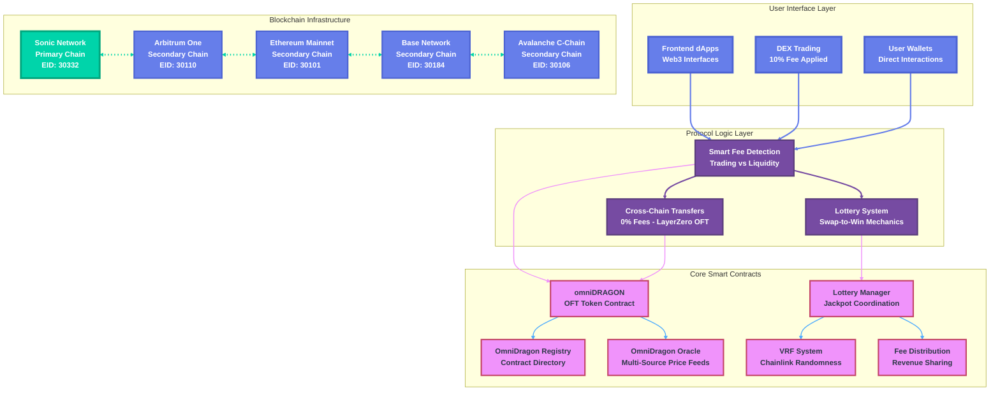
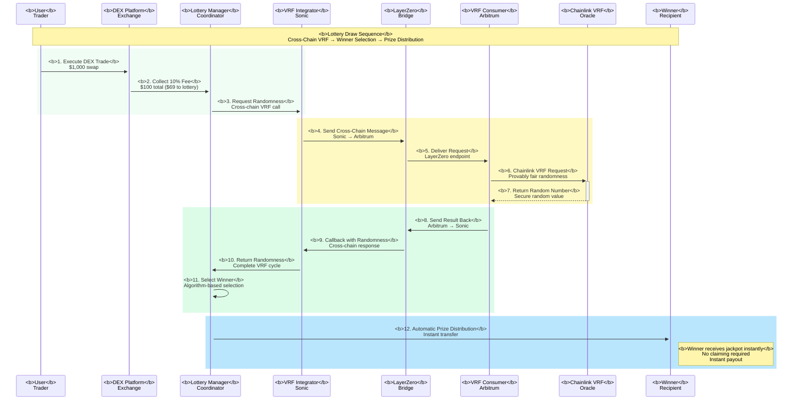
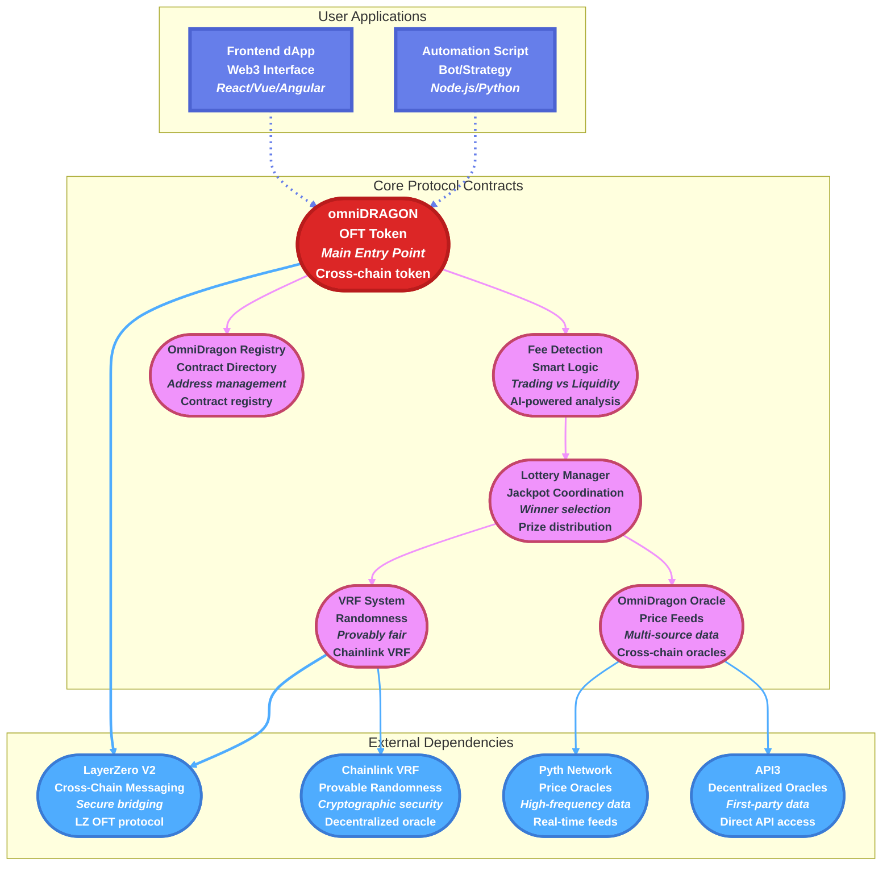
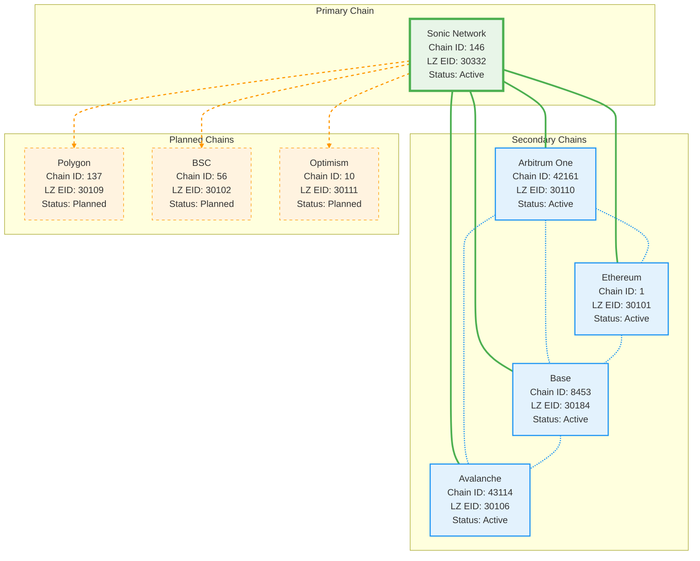
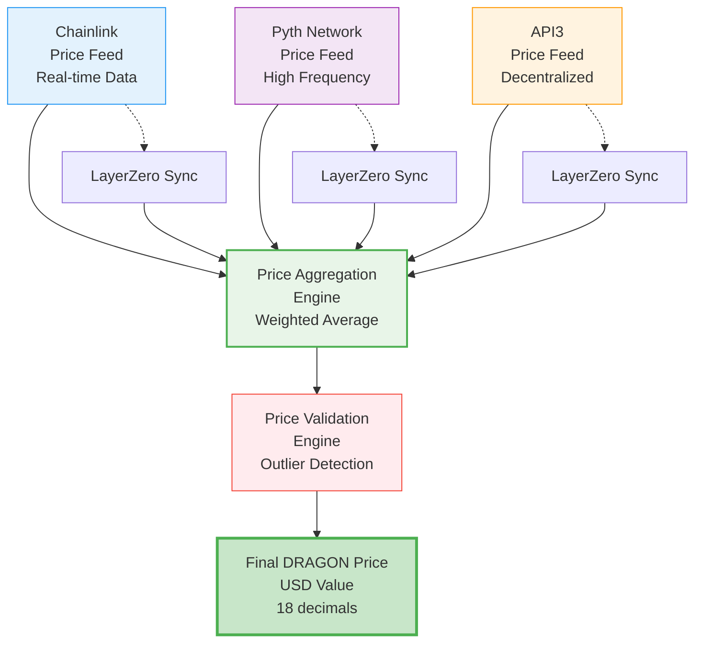
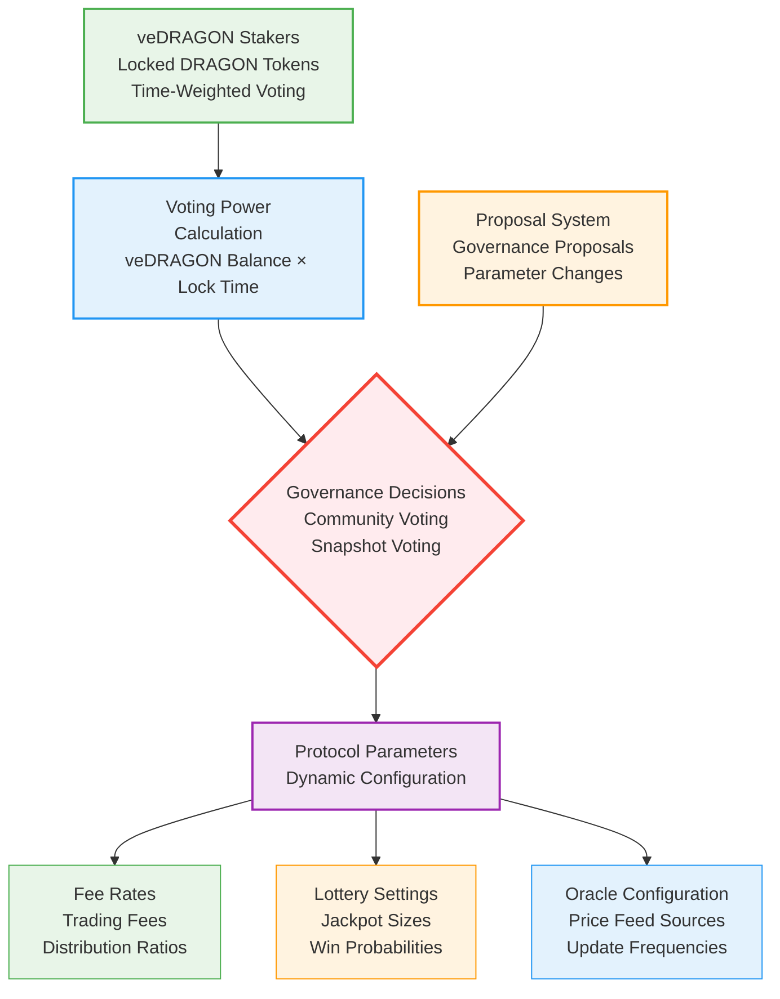
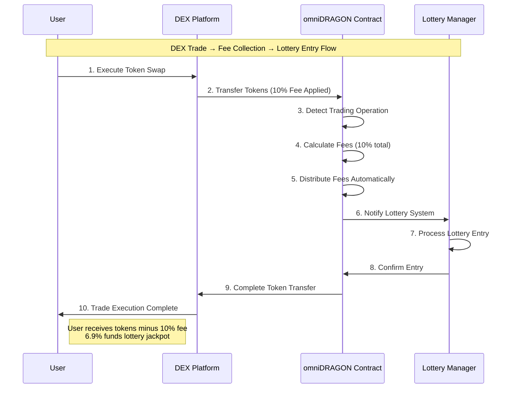
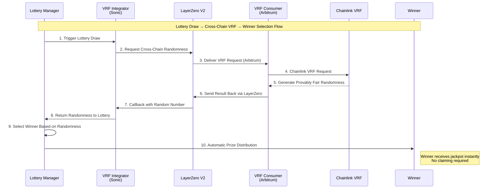
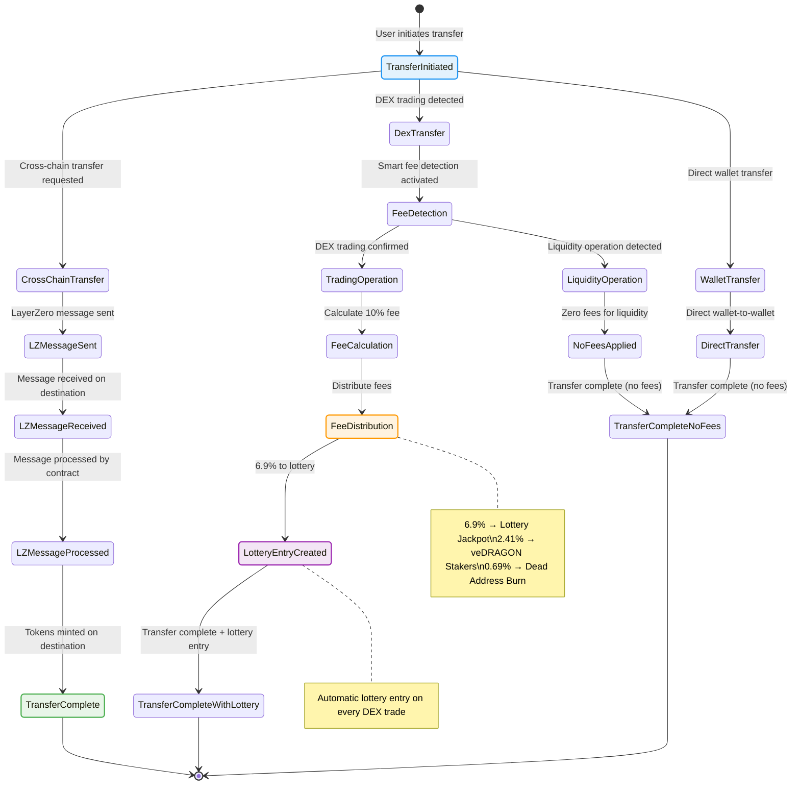

# omniDRAGON Architecture Diagrams

Visual representations of the omniDRAGON protocol architecture, token flows, and system interactions using interactive Mermaid diagrams.

## System Overview

### High-Level Architecture



## Token Flow Diagrams

### Fee Distribution Flow

```mermaid
flowchart TD
    %% Define beautiful styling classes
    classDef tradeStart fill:#4ade80,stroke:#22c55e,stroke-width:4px,color:#ffffff,font-weight:bold,font-size:14px,shadow:lg
    classDef decision fill:#f59e0b,stroke:#d97706,stroke-width:3px,color:#ffffff,font-weight:bold,font-size:13px,shadow:lg
    classDef lottery fill:#dc2626,stroke:#b91c1c,stroke-width:3px,color:#ffffff,font-weight:bold,font-size:13px,shadow:lg
    classDef revenue fill:#3b82f6,stroke:#2563eb,stroke-width:3px,color:#ffffff,font-weight:bold,font-size:13px,shadow:lg
    classDef burn fill:#7c3aed,stroke:#5b21b6,stroke-width:3px,color:#ffffff,font-weight:bold,font-size:13px,shadow:lg
    classDef zeroFee fill:#10b981,stroke:#059669,stroke-width:3px,color:#ffffff,font-weight:bold,font-size:13px,shadow:lg

    A[<b>User DEX Trade</b><br/>10% Fee Collected<br/><i>$1,000 trade = $100 fee</i>]:::tradeStart
    B{<b>Smart Fee Detection</b><br/>Trading Operation?<br/><i>DEX vs Liquidity</i>}:::decision

    B -->|Yes - DEX Trade| C[<b>Lottery Pool</b><br/>6.9% of Fee<br/><i>$69 → Jackpots</i>]:::lottery
    B -->|No - Transfer/Liquidity| D[<b>Zero Fee Operation</b><br/>No Distribution<br/><i>Free transfers</i>]:::zeroFee

    C --> E[<b>Jackpot Vault</b><br/>Unified Cross-Chain Pool<br/><i>Accumulated prizes</i>]:::lottery
    C --> F[<b>Lottery Odds</b><br/>Dynamic Probability<br/><i>Trade size affects odds</i>]:::lottery

    B -->|Yes - DEX Trade| G[<b>Revenue Distribution</b><br/>2.41% of Fee<br/><i>$24.10 → Stakers</i>]:::revenue
    G --> H[<b>veDRAGON Stakers</b><br/>Time-Weighted Rewards<br/><i>Lock for boosted yields</i>]:::revenue

    B -->|Yes - DEX Trade| I[<b>Burn Mechanism</b><br/>0.69% of Fee<br/><i>$6.90 → Dead address</i>]:::burn
    I --> J[<b>Dead Address</b><br/>Permanent Removal<br/><i>Deflationary burn</i>]:::burn

    %% Enhanced link styling with gradients
    linkStyle 0 stroke:#4ade80,stroke-width:4px
    linkStyle 1 stroke:#dc2626,stroke-width:3px
    linkStyle 2 stroke:#10b981,stroke-width:3px
    linkStyle 3 stroke:#dc2626,stroke-width:2px
    linkStyle 4 stroke:#dc2626,stroke-width:2px
    linkStyle 5 stroke:#3b82f6,stroke-width:3px
    linkStyle 6 stroke:#3b82f6,stroke-width:2px
    linkStyle 7 stroke:#7c3aed,stroke-width:3px
    linkStyle 8 stroke:#7c3aed,stroke-width:2px
```

### Lottery Win Flow



### Cross-Chain Transfer Flow

```mermaid
flowchart TD
    %% Define beautiful styling classes for cross-chain flow
    classDef startPoint fill:#4ade80,stroke:#22c55e,stroke-width:4px,color:#ffffff,font-weight:bold,font-size:14px,shadow:lg
    classDef quoteStep fill:#f59e0b,stroke:#d97706,stroke-width:3px,color:#ffffff,font-weight:bold,font-size:13px,shadow:lg
    classDef decision fill:#dc2626,stroke:#b91c1c,stroke-width:3px,color:#ffffff,font-weight:bold,font-size:13px,shadow:lg
    classDef network fill:#3b82f6,stroke:#2563eb,stroke-width:3px,color:#ffffff,font-weight:bold,font-size:13px,shadow:lg
    classDef endpoint fill:#7c3aed,stroke:#5b21b6,stroke-width:3px,color:#ffffff,font-weight:bold,font-size:13px,shadow:lg
    classDef contract fill:#059669,stroke:#047857,stroke-width:3px,color:#ffffff,font-weight:bold,font-size:13px,shadow:lg
    classDef success fill:#10b981,stroke:#059669,stroke-width:4px,color:#ffffff,font-weight:bold,font-size:14px,shadow:xl

    A[<b>User Initiates Transfer</b><br/>DRAGON Tokens<br/><i>1000 DRAGON → Arbitrum</i>]:::startPoint
    B[<b>Quote LayerZero Fee</b><br/>Calculate Cross-Chain Cost<br/><i>~0.000034 ETH</i>]:::quoteStep

    B --> C{<b>Pay LZ Fee + Send Message</b><br/>Confirm transaction<br/><i>Gas + Bridge fee</i>}:::decision

    C --> D[<b>LayerZero Network</b><br/>Message Routing<br/><i>Secure cross-chain delivery</i>]:::network

    D --> E[<b>LZ Endpoint</b><br/>Destination Chain<br/><i>Arbitrum network</i>]:::endpoint

    E --> F[<b>omniDRAGON Contract</b><br/>Destination Chain<br/><i>Same address on all chains</i>]:::contract

    F --> G[<b>Tokens Minted</b><br/>Recipient Receives DRAGON<br/><i>Instant cross-chain transfer</i>]:::success

    %% Enhanced gradient link styling
    linkStyle 0 stroke:#4ade80,stroke-width:4px,stroke-dasharray: none
    linkStyle 1 stroke:#f59e0b,stroke-width:3px,stroke-dasharray: none
    linkStyle 2 stroke:#dc2626,stroke-width:3px,stroke-dasharray: none
    linkStyle 3 stroke:#3b82f6,stroke-width:3px,stroke-dasharray: none
    linkStyle 4 stroke:#7c3aed,stroke-width:3px,stroke-dasharray: none
    linkStyle 5 stroke:#059669,stroke-width:4px,stroke-dasharray: none
```

## Component Architecture

### Contract Dependencies



### Network Architecture



## Data Flow Diagrams

### Price Oracle Flow



### Governance Flow (Future)



## Sequence Diagrams

### DEX Trade Sequence



### Lottery Win Sequence



## State Diagrams

### Token Transfer States



---

*These diagrams provide a comprehensive visual overview of the omniDRAGON ecosystem architecture and data flows.*
