# omniDRAGON Architecture Diagrams

Visual representations of the omniDRAGON protocol architecture, token flows, and system interactions using interactive Mermaid diagrams.

## System Overview

### High-Level Architecture

```mermaid
graph TB
    subgraph "User Interface Layer"
        FE[🎨 Frontend dApps<br/>Web3 Interfaces]
        DEX[💱 DEX Trading<br/>10% Fee Applied]
        WALLET[👛 User Wallets<br/>Direct Interactions]
    end

    subgraph "Protocol Logic Layer"
        FEES[🧠 Smart Fee Detection<br/>Trading vs Liquidity]
        LOTTERY[🎰 Lottery System<br/>Swap-to-Win Mechanics]
        BRIDGE[🌐 Cross-Chain Transfers<br/>0% Fees - LayerZero OFT]
    end

    subgraph "Core Smart Contracts"
        DRAGON[🐉 omniDRAGON<br/>OFT Token Contract]
        REGISTRY[📋 OmniDragon Registry<br/>Contract Directory]
        ORACLE[🔮 OmniDragon Oracle<br/>Multi-Source Price Feeds]
        LOTTERY_MGR[🎲 Lottery Manager<br/>Jackpot Coordination]
        VRF[🎯 VRF System<br/>Chainlink Randomness]
        FEE_DIST[💰 Fee Distribution<br/>Revenue Sharing]
    end

    subgraph "Blockchain Infrastructure"
        SONIC[Sonic Network<br/>🟢 Primary Chain<br/>EID: 30332]
        ARBITRUM[Arbitrum One<br/>🔵 Secondary Chain<br/>EID: 30110]
        ETHEREUM[Ethereum Mainnet<br/>🔵 Secondary Chain<br/>EID: 30101]
        BASE[Base Network<br/>🔵 Secondary Chain<br/>EID: 30184]
        AVALANCHE[Avalanche C-Chain<br/>🔵 Secondary Chain<br/>EID: 30106]
    end

    FE --> FEES
    DEX --> FEES
    WALLET --> FEES

    FEES --> LOTTERY
    FEES --> BRIDGE

    FEES --> DRAGON
    LOTTERY --> LOTTERY_MGR
    BRIDGE --> DRAGON

    DRAGON --> REGISTRY
    DRAGON --> ORACLE
    LOTTERY_MGR --> VRF
    LOTTERY_MGR --> FEE_DIST

    SONIC <--> ARBITRUM
    ARBITRUM <--> ETHEREUM
    ETHEREUM <--> BASE
    BASE <--> AVALANCHE

    style SONIC fill:#e8f5e8,stroke:#4caf50,stroke-width:3px
    style ARBITRUM fill:#e3f2fd,stroke:#2196f3,stroke-width:2px
    style ETHEREUM fill:#e3f2fd,stroke:#2196f3,stroke-width:2px
    style BASE fill:#e3f2fd,stroke:#2196f3,stroke-width:2px
    style AVALANCHE fill:#e3f2fd,stroke:#2196f3,stroke-width:2px

    linkStyle 12,13,14,15 stroke:#ff9800,stroke-width:3px,stroke-dasharray: 5 5
```

## Token Flow Diagrams

### Fee Distribution Flow

```mermaid
flowchart TD
    A[👤 User DEX Trade<br/>💰 10% Fee Collected] --> B{🧠 Smart Fee Detection<br/>Trading Operation?}

    B -->|Yes - DEX Trade| C[🎰 Lottery Pool<br/>6.9% of Fee]
    B -->|No - Transfer/Liquidity| D[✨ Zero Fee Operation<br/>No Distribution]

    C --> E[🎲 Jackpot Vault<br/>Unified Cross-Chain Pool]
    C --> F[📊 Lottery Odds Calculation<br/>Dynamic Probability]

    B -->|Yes - DEX Trade| G[💰 Revenue Distribution<br/>2.41% of Fee]
    G --> H[🔒 veDRAGON Stakers<br/>Time-Weighted Rewards]

    B -->|Yes - DEX Trade| I[🔥 Burn Mechanism<br/>0.69% of Fee]
    I --> J[♻️ Dead Address<br/>Permanent Removal]

    style A fill:#e8f5e8,stroke:#4caf50
    style E fill:#fff3e0,stroke:#ff9800
    style H fill:#e3f2fd,stroke:#2196f3
    style J fill:#ffebee,stroke:#f44336
    style D fill:#f3e5f5,stroke:#9c27b0
```

### Lottery Win Flow

```mermaid
sequenceDiagram
    participant U as 👤 User
    participant DEX as 💱 DEX
    participant LM as 🎲 Lottery Manager
    participant VRF_I as 🎯 VRF Integrator<br/>(Sonic)
    participant LZ as 🌐 LayerZero
    participant VRF_C as 🎯 VRF Consumer<br/>(Arbitrum)
    participant CL as 🔗 Chainlink VRF
    participant W as 🏆 Winner

    Note over U,W: Lottery Win Sequence Flow

    U->>DEX: Execute DEX Trade
    DEX->>LM: Collect 10% Fee (6.9% to Lottery)
    LM->>VRF_I: Request Randomness
    VRF_I->>LZ: Cross-Chain Message
    LZ->>VRF_C: Deliver Request (Arbitrum)
    VRF_C->>CL: Chainlink VRF Request
    CL-->>VRF_C: Return Random Number
    VRF_C->>LZ: Send Result Back
    LZ->>LM: Callback with Randomness
    LM->>LM: Select Winner Based on Randomness
    LM->>W: 🎉 Automatic Prize Distribution

    Note right of W: Winner receives jackpot instantly!
```

### Cross-Chain Transfer Flow

```mermaid
flowchart TD
    A[👤 User Initiates Transfer<br/>🐉 DRAGON Tokens] --> B[📋 Quote LayerZero Fee<br/>~0.000034 ETH]

    B --> C{💰 Pay LZ Fee<br/>+ Send Message}

    C --> D[🌐 LayerZero Network<br/>Message Routing]

    D --> E[📡 LZ Endpoint<br/>Destination Chain]

    E --> F[🎯 omniDRAGON Contract<br/>Destination Chain]

    F --> G[✅ Tokens Minted<br/>Recipient Receives DRAGON]

    style A fill:#e8f5e8,stroke:#4caf50
    style B fill:#fff3e0,stroke:#ff9800
    style D fill:#e3f2fd,stroke:#2196f3
    style G fill:#c8e6c9,stroke:#4caf50

    linkStyle 0,1,2,3,4,5 stroke:#2196f3,stroke-width:2px
```

## Component Architecture

### Contract Dependencies

```mermaid
graph TD
    subgraph "User Applications"
        DAPP[🎨 Frontend dApp<br/>Web3 Interface]
        SCRIPT[🤖 Automation Script<br/>Bot/Strategy]
    end

    subgraph "Core Protocol Contracts"
        DRAGON([🐉 omniDRAGON<br/>OFT Token<br/>Main Entry Point])
        FEESYS([🧠 Fee Detection<br/>Smart Logic])
        LOTTERY([🎰 Lottery Manager<br/>Jackpot Coordination])
        REGISTRY([📋 OmniDragon Registry<br/>Contract Directory])
        ORACLE([🔮 OmniDragon Oracle<br/>Price Feeds])
        VRF([🎯 VRF System<br/>Randomness])
    end

    subgraph "External Dependencies"
        LZ([🌐 LayerZero V2<br/>Cross-Chain Messaging])
        CHAINLINK([🔗 Chainlink VRF<br/>Provable Randomness])
        PYTH([📊 Pyth Network<br/>Price Oracles])
        API3([📈 API3<br/>Decentralized Oracles])
    end

    DAPP --> DRAGON
    SCRIPT --> DRAGON

    DRAGON --> FEESYS
    DRAGON --> REGISTRY

    FEESYS --> LOTTERY
    LOTTERY --> VRF
    LOTTERY --> ORACLE

    VRF --> CHAINLINK
    ORACLE --> PYTH
    ORACLE --> API3

    DRAGON --> LZ
    VRF --> LZ

    style DRAGON fill:#ffebee,stroke:#f44336,stroke-width:3px
    style FEESYS fill:#fff3e0,stroke:#ff9800
    style LOTTERY fill:#f3e5f5,stroke:#9c27b0
    style LZ fill:#e3f2fd,stroke:#2196f3,stroke-width:2px
```

### Network Architecture

```mermaid
graph TD
    subgraph "Primary Chain"
        SONIC[Sonic Network<br/>🟢 Chain ID: 146<br/>LZ EID: 30332<br/>Status: Active]
    end

    subgraph "Secondary Chains"
        ARBITRUM[Arbitrum One<br/>🔵 Chain ID: 42161<br/>LZ EID: 30110<br/>Status: Active]
        ETHEREUM[Ethereum<br/>🔵 Chain ID: 1<br/>LZ EID: 30101<br/>Status: Active]
        BASE[Base<br/>🔵 Chain ID: 8453<br/>LZ EID: 30184<br/>Status: Active]
        AVALANCHE[Avalanche<br/>🔵 Chain ID: 43114<br/>LZ EID: 30106<br/>Status: Active]
    end

    subgraph "Planned Chains"
        POLYGON[Polygon<br/>🟡 Chain ID: 137<br/>LZ EID: 30109<br/>Status: Planned]
        BSC[BSC<br/>🟡 Chain ID: 56<br/>LZ EID: 30102<br/>Status: Planned]
        OPTIMISM[Optimism<br/>🟡 Chain ID: 10<br/>LZ EID: 30111<br/>Status: Planned]
    end

    SONIC --- ARBITRUM
    SONIC --- ETHEREUM
    SONIC --- BASE
    SONIC --- AVALANCHE
    SONIC -.-> POLYGON
    SONIC -.-> BSC
    SONIC -.-> OPTIMISM

    ARBITRUM --- ETHEREUM
    ARBITRUM --- BASE
    ARBITRUM --- AVALANCHE
    BASE --- AVALANCHE
    ETHEREUM --- BASE

    style SONIC fill:#e8f5e8,stroke:#4caf50,stroke-width:4px
    style ARBITRUM fill:#e3f2fd,stroke:#2196f3,stroke-width:2px
    style ETHEREUM fill:#e3f2fd,stroke:#2196f3,stroke-width:2px
    style BASE fill:#e3f2fd,stroke:#2196f3,stroke-width:2px
    style AVALANCHE fill:#e3f2fd,stroke:#2196f3,stroke-width:2px
    style POLYGON fill:#fff3e0,stroke:#ff9800,stroke-dasharray: 5 5
    style BSC fill:#fff3e0,stroke:#ff9800,stroke-dasharray: 5 5
    style OPTIMISM fill:#fff3e0,stroke:#ff9800,stroke-dasharray: 5 5

    linkStyle 0,1,2,3 stroke:#4caf50,stroke-width:3px
    linkStyle 4,5,6 stroke:#ff9800,stroke-width:2px,stroke-dasharray: 5 5
    linkStyle 7,8,9,10,11 stroke:#2196f3,stroke-width:2px,stroke-dasharray: 2 2
```

## Data Flow Diagrams

### Price Oracle Flow

```mermaid
flowchart TD
    CL[🔗 Chainlink<br/>Price Feed<br/>Real-time Data] --> AGG
    PYTH[📊 Pyth Network<br/>Price Feed<br/>High Frequency] --> AGG
    API3[📈 API3<br/>Price Feed<br/>Decentralized] --> AGG

    AGG[🔮 Price Aggregation<br/>Engine<br/>Weighted Average] --> VAL

    VAL[✅ Price Validation<br/>Engine<br/>Outlier Detection] --> FINAL

    FINAL[💰 Final DRAGON Price<br/>USD Value<br/>18 decimals]

    CL -.-> LZ1[🌐 LayerZero Sync]
    PYTH -.-> LZ2[🌐 LayerZero Sync]
    API3 -.-> LZ3[🌐 LayerZero Sync]

    LZ1 --> AGG
    LZ2 --> AGG
    LZ3 --> AGG

    style CL fill:#e3f2fd,stroke:#2196f3
    style PYTH fill:#f3e5f5,stroke:#9c27b0
    style API3 fill:#fff3e0,stroke:#ff9800
    style AGG fill:#e8f5e8,stroke:#4caf50,stroke-width:2px
    style VAL fill:#ffebee,stroke:#f44336
    style FINAL fill:#c8e6c9,stroke:#4caf50,stroke-width:3px
```

### Governance Flow (Future)

```mermaid
flowchart TD
    STAKERS[👥 veDRAGON Stakers<br/>🔒 Locked DRAGON Tokens<br/>⏰ Time-Weighted Voting] --> VOTING

    VOTING[🗳️ Voting Power<br/>Calculation<br/>veDRAGON Balance × Lock Time] --> DECISIONS

    PROPOSALS[📝 Proposal System<br/>Governance Proposals<br/>Parameter Changes] --> DECISIONS

    DECISIONS{🎯 Governance Decisions<br/>Community Voting<br/>Snapshot Voting} --> PARAMETERS

    PARAMETERS[⚙️ Protocol Parameters<br/>Dynamic Configuration]

    PARAMETERS --> FEES[💰 Fee Rates<br/>Trading Fees<br/>Distribution Ratios]

    PARAMETERS --> LOTTERY[🎰 Lottery Settings<br/>Jackpot Sizes<br/>Win Probabilities]

    PARAMETERS --> ORACLE[🔮 Oracle Configuration<br/>Price Feed Sources<br/>Update Frequencies]

    style STAKERS fill:#e8f5e8,stroke:#4caf50,stroke-width:2px
    style VOTING fill:#e3f2fd,stroke:#2196f3,stroke-width:2px
    style PROPOSALS fill:#fff3e0,stroke:#ff9800,stroke-width:2px
    style DECISIONS fill:#ffebee,stroke:#f44336,stroke-width:3px
    style PARAMETERS fill:#f3e5f5,stroke:#9c27b0,stroke-width:2px
    style FEES fill:#e8f5e8,stroke:#4caf50
    style LOTTERY fill:#fff3e0,stroke:#ff9800
    style ORACLE fill:#e3f2fd,stroke:#2196f3
```

## Sequence Diagrams

### DEX Trade Sequence

```mermaid
sequenceDiagram
    participant U as 👤 User
    participant DEX as 💱 DEX Platform
    participant DRAGON as 🐉 omniDRAGON Contract
    participant LOTTERY as 🎰 Lottery Manager

    Note over U,LOTTERY: DEX Trade → Fee Collection → Lottery Entry Flow

    U->>DEX: 1. Execute Token Swap
    DEX->>DRAGON: 2. Transfer Tokens (10% Fee Applied)

    DRAGON->>DRAGON: 3. Detect Trading Operation
    DRAGON->>DRAGON: 4. Calculate Fees (10% total)
    DRAGON->>DRAGON: 5. Distribute Fees Automatically

    DRAGON->>LOTTERY: 6. Notify Lottery System
    LOTTERY->>LOTTERY: 7. Process Lottery Entry
    LOTTERY->>DRAGON: 8. Confirm Entry

    DRAGON->>DEX: 9. Complete Token Transfer
    DEX->>U: 10. Trade Execution Complete

    Note right of U: User receives tokens minus 10% fee<br/>6.9% funds lottery jackpot
```

### Lottery Win Sequence

```mermaid
sequenceDiagram
    participant LM as 🎰 Lottery Manager
    participant VRF_I as 🎯 VRF Integrator<br/>(Sonic)
    participant LZ as 🌐 LayerZero V2
    participant VRF_C as 🎯 VRF Consumer<br/>(Arbitrum)
    participant CL as 🔗 Chainlink VRF
    participant WINNER as 🏆 Winner

    Note over LM,WINNER: Lottery Draw → Cross-Chain VRF → Winner Selection Flow

    LM->>VRF_I: 1. Trigger Lottery Draw
    VRF_I->>LZ: 2. Request Cross-Chain Randomness
    LZ->>VRF_C: 3. Deliver VRF Request (Arbitrum)
    VRF_C->>CL: 4. Chainlink VRF Request
    CL-->>VRF_C: 5. Generate Provably Fair Randomness
    VRF_C->>LZ: 6. Send Result Back via LayerZero
    LZ->>VRF_I: 7. Callback with Random Number
    VRF_I->>LM: 8. Return Randomness to Lottery
    LM->>LM: 9. Select Winner Based on Randomness
    LM->>WINNER: 10. 🎉 Automatic Prize Distribution

    Note right of WINNER: Winner receives jackpot instantly<br/>No claiming required!
```

## State Diagrams

### Token Transfer States

```mermaid
stateDiagram-v2
    [*] --> TransferInitiated: User initiates transfer

    TransferInitiated --> CrossChainTransfer: Cross-chain transfer requested
    TransferInitiated --> DexTransfer: DEX trading detected
    TransferInitiated --> WalletTransfer: Direct wallet transfer

    CrossChainTransfer --> LZMessageSent: LayerZero message sent
    LZMessageSent --> LZMessageReceived: Message received on destination
    LZMessageReceived --> LZMessageProcessed: Message processed by contract
    LZMessageProcessed --> TransferComplete: Tokens minted on destination

    DexTransfer --> FeeDetection: Smart fee detection activated
    FeeDetection --> TradingOperation: DEX trading confirmed
    FeeDetection --> LiquidityOperation: Liquidity operation detected

    TradingOperation --> FeeCalculation: Calculate 10% fee
    FeeCalculation --> FeeDistribution: Distribute fees
    FeeDistribution --> LotteryEntryCreated: 6.9% to lottery
    LotteryEntryCreated --> TransferCompleteWithLottery: Transfer complete + lottery entry

    LiquidityOperation --> NoFeesApplied: Zero fees for liquidity
    NoFeesApplied --> TransferCompleteNoFees: Transfer complete (no fees)

    WalletTransfer --> DirectTransfer: Direct wallet-to-wallet
    DirectTransfer --> TransferCompleteNoFees: Transfer complete (no fees)

    TransferComplete --> [*]
    TransferCompleteWithLottery --> [*]
    TransferCompleteNoFees --> [*]

    note right of FeeDistribution : 6.9% → Lottery Jackpot\n2.41% → veDRAGON Stakers\n0.69% → Dead Address Burn
    note right of LotteryEntryCreated : Automatic lottery entry on every DEX trade

    style TransferInitiated fill:#e3f2fd,stroke:#2196f3,stroke-width:2px
    style FeeDistribution fill:#fff3e0,stroke:#ff9800,stroke-width:2px
    style LotteryEntryCreated fill:#f3e5f5,stroke:#9c27b0,stroke-width:2px
    style TransferComplete fill:#e8f5e8,stroke:#4caf50,stroke-width:2px
```

---

*These diagrams provide a comprehensive visual overview of the omniDRAGON ecosystem architecture and data flows.*
